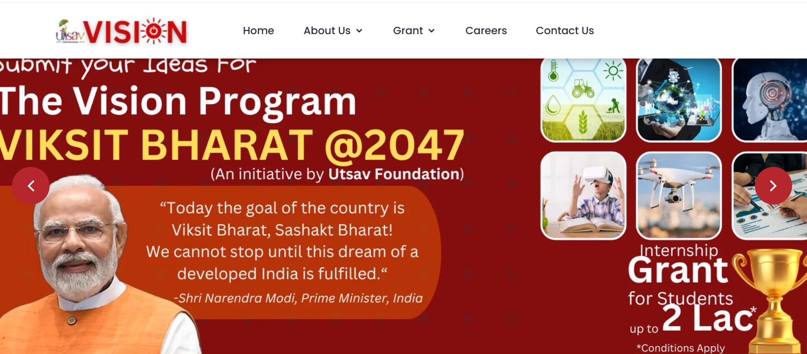
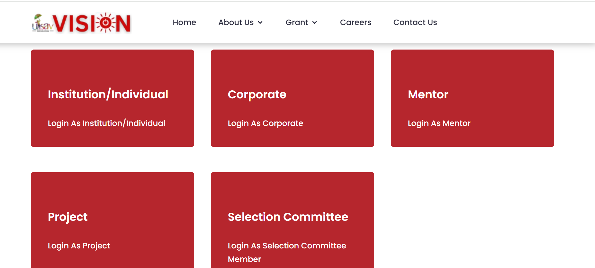
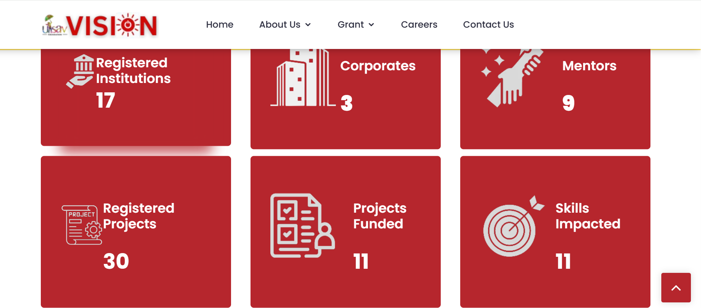

# 🌐 VISION Program Web Application — Multi-Role Innovation Portal


> A responsive innovation management portal built during my internship for multiple roles: Students, Selectors, Sponsors, and Mentors.  

> **Note:** Source code is proprietary. This repository serves as a case study showcasing architecture, features, and my contributions.

---

## 🔗 Live Demo
Check out the live portal here: [www.viksitbharatinnovation.com](https://www.viksitbharatinnovation.com)

---

## 🚀 Project Overview
- **Goal:** Build a secure, multi-role web portal to manage student innovation projects across submission, selection, sponsorship, and mentorship workflows.  
- **Role:** Full-stack developer (authentication, workflow design, role-based access, backend integration).  
- **Outcome:** Successfully deployed and actively used by the organization for managing innovation projects.

---

## 🛠 Tech Stack
- **Frontend:** HTML5, CSS3, JavaScript  
- **Backend:** PHP (session-based authentication)  
- **Database:** MySQL  
- **Security:** CAPTCHA, role-based access, session auth  
- **Hosting:** Live on server

---

## ✨ Features
- 🎓 **Students Panel**: Submit projects with descriptions & files  
- 📝 **Selectors Panel**: Review and shortlist university submissions  
- 💰 **Sponsors Panel**: View shortlisted projects and commit sponsorships  
- 👨‍🏫 **Mentors Panel**: Guide students through project completion  
- Role-based access control with session authentication  
- CAPTCHA protection on critical forms  
- Step-by-step workflow: **Submission → Selection → Sponsorship → Mentorship**  
- Responsive design for web and mobile  

---

## 📊 Workflow Diagram
```mermaid
flowchart LR
    A[Student Submission] --> B[Selectors Review]
    B --> C[Sponsors Commit]
    C --> D[Mentors Guide Students]

 ```
## 🖼 Screenshots

**Homepage**  


**Panels Overview**  


**Live Enrollment**  


**Login with CAPTCHA**  


